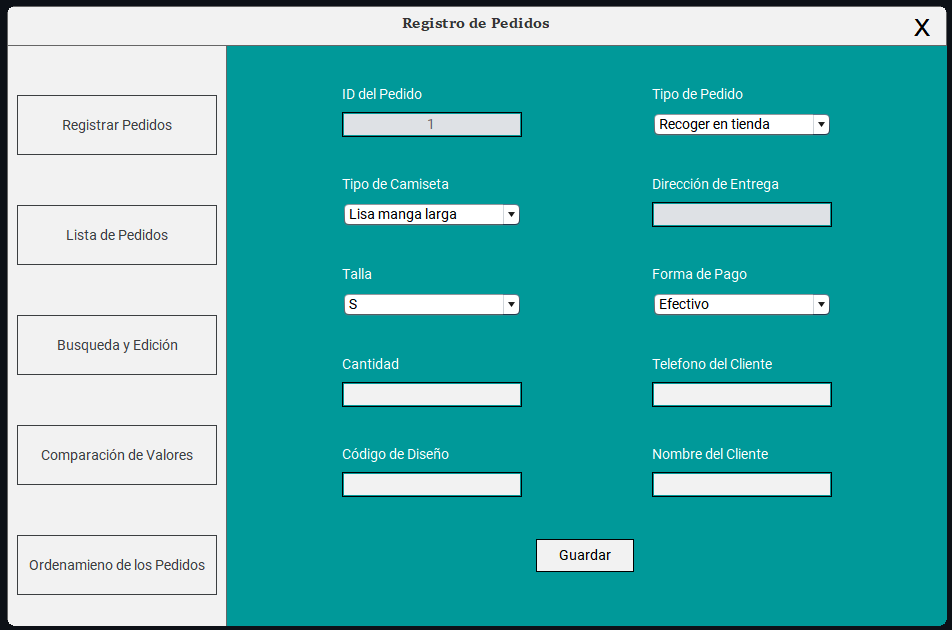
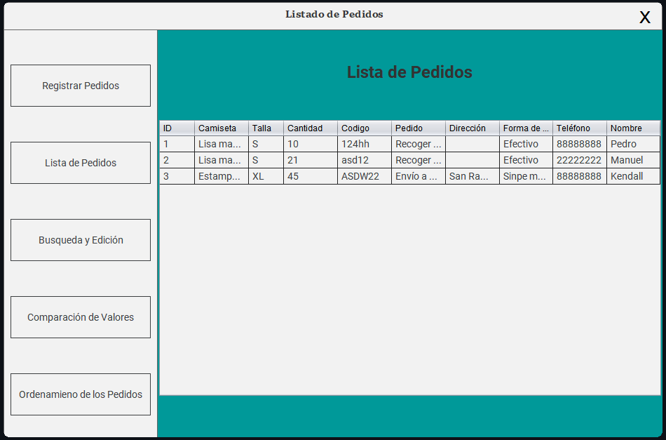
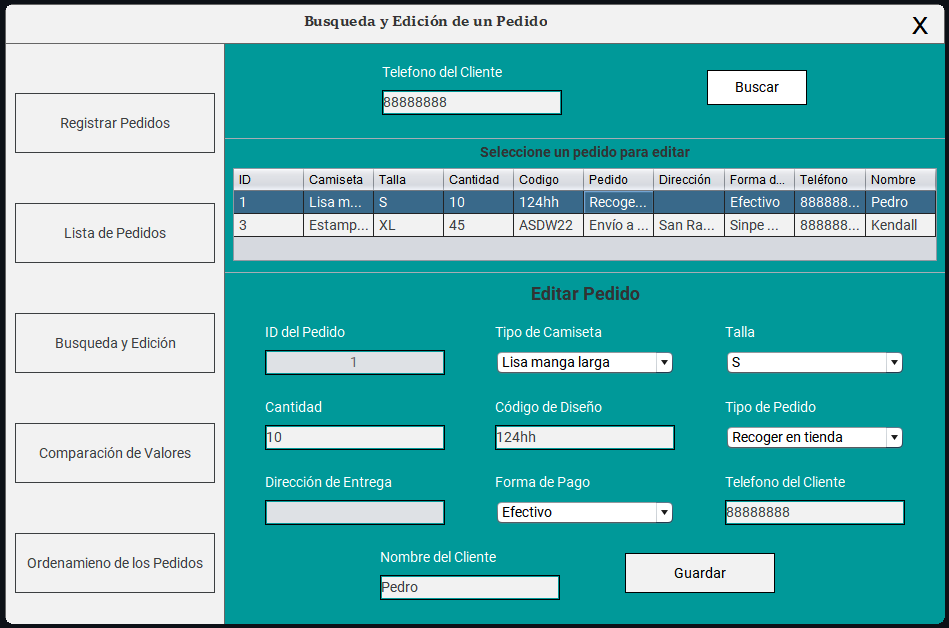
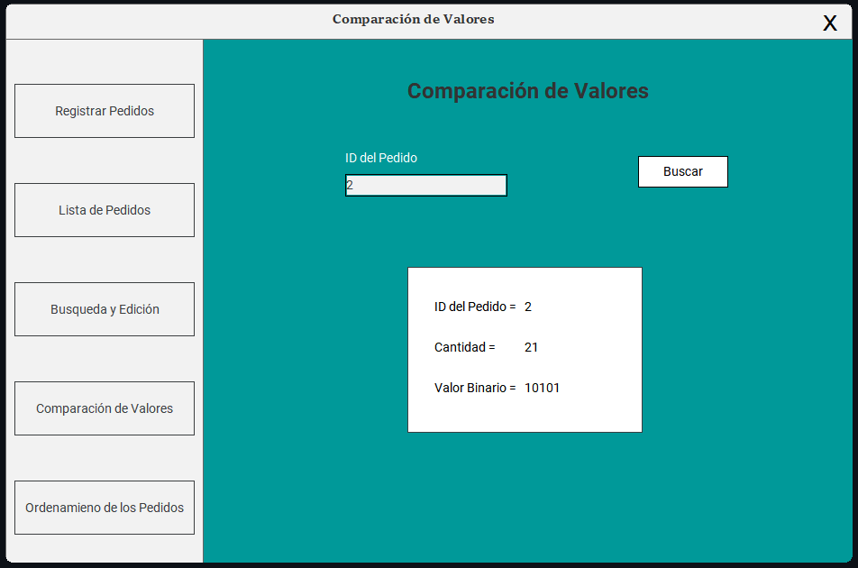
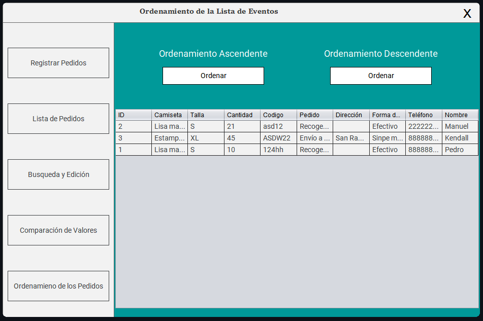

# Registro de Pedidos XDesign

**Registro de Pedidos XDesign** es un proyecto en Java desarrollado para la asignatura de Estructura de Datos en el II Cuatrimestre de 2024 en la Universidad Estatal a Distancia (UNED). Este sistema gestiona pedidos de camisetas estampadas para una empresa ficticia, XDesign.

## Descripción del Proyecto

Este programa permite llevar un registro de pedidos de camisetas mediante una interfaz gráfica. Las funcionalidades principales incluyen:

- **Registro de Pedidos:** Agrega pedidos con campos como ID, tipo de camiseta, talla, cantidad, código de diseño, tipo de pedido, dirección de entrega, forma de pago, número telefónico y nombre del cliente.


- **Listado de Pedidos:** Muestra todos los pedidos en una tabla.


- **Búsqueda y Edición:** Busca pedidos por número telefónico y permite la edición de detalles, excepto el ID del pedido.


- **Comparación de Valores:** Convierte la cantidad de un pedido de decimal a binario usando recursión.


- **Ordenamiento:** Ordena pedidos por número telefónico (ascendente) y código de diseño (descendente) utilizando algoritmos de ordenamiento específicos.


También puedes ver el [Video Demostración](Demostración/Demo.mp4) completo.

## Tecnologías Utilizadas

- **Lenguaje:** Java
- **IDE:** NetBeans (última versión)
- **Interfaz Gráfica:** Swing

## Instrucciones de Uso

1. Clona el repositorio en tu máquina local:
    ```bash
    git clone https://github.com/tu-usuario/RegistroDePedidosXDesign.git
    ```
2. Abre el proyecto en NetBeans.
3. Compila y ejecuta el proyecto.
4. Utiliza la interfaz gráfica para gestionar pedidos.

## Notas

- Este proyecto fue desarrollado como parte del curso de Estructura de Datos en la UNED y es un ejemplo académico. 
- Consulta el código y la documentación dentro del proyecto para detalles sobre la implementación y el uso.

Para cualquier duda o contribución, siéntete libre de abrir un *issue* o enviar un *pull request*.
